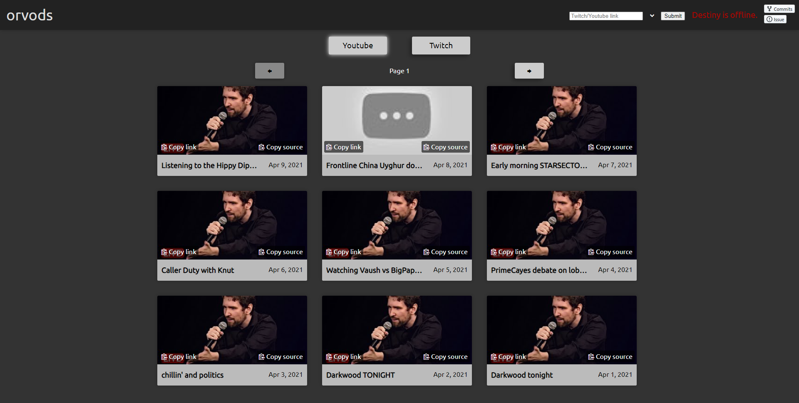
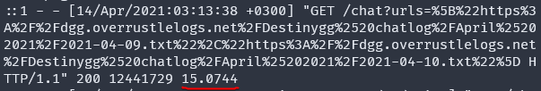
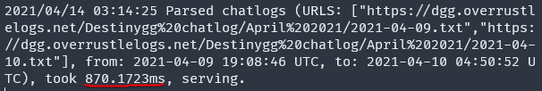

# orvods-go



**orvods-go** is a fork of [OverRustle VODs](https://github.com/jacobnisnevich/overrustle-vods) written in go. It plays Twitch VODs/Youtube VODs or videos with the destiny.gg chat replay along the side. This version is **significantly** faster than the old one and has a lot more features (though, granted, most can be backported due to being webpage/js changes).

The first screenshot is the old version's speed clocking at blazing 15 seconds, the second is the newer version with 870 milliseconds.




---

## How to deploy

1. Obtain the necessary API tokens from [Twitch](https://dev.twitch.tv) and [Youtube](http://console.developers.google.com/).
2. ```cp .env.example .env```
3. Add your API keys/tokens in the ```.env``` file and change other options how you see fit.
4. Remove my analytics (look for the "Matomo" comment in the ```index.html``` file).
5. (optional) If you have a logging system of your own and dont want to use mine, make sure to edit ```util.js``` with your own APIs.
6. (optional) Change the ```docker-compose.yml``` file/incorporate it into your own setup.
7. ```docker-compose up -d```

---

## People worth crediting, that are not listed as contributors

- [jacobnisnevich](https://github.com/jacobnisnevich) - for developing the initial project in the first place! <3
- [gabrieljablonski](https://github.com/gabrieljablonski) - for helping out with [random delays between messages](https://github.com/vyneer/orvods-go/pull/10) and with message order ideas on reddit. <3